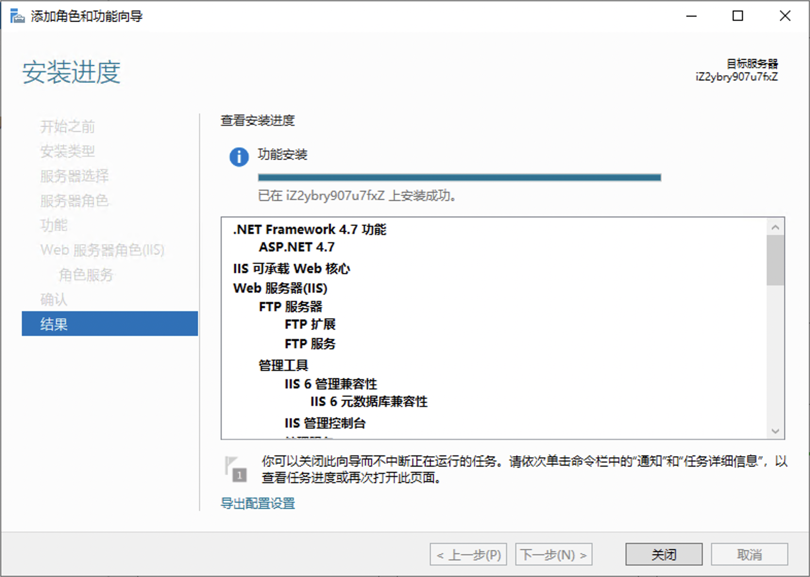

# Windows配置SSL证书

## 目录

[TOC]

## 一.前提条件

- Web服务器类型是IIS。
- 要安装的证书已通过CA中心审核并签发。

## 二.安装配置

### 1. SSL证书（IIS）下载

将已签发的SSL证书（IIS）下载到服务器。

### 2.解压缩已下载的SSL证书（IIS）压缩包并上传到服务器

- 证书文件（PFX格式）：以`证书ID_证书绑定域名`方式命名。
- 私钥文件（TXT格式）：名称为pfx-password，内容为证书的密码。

### 3.导入证书

1.在服务器按Win+R键，打开运行，输入mmc，单击确定。

2.为本地计算机添加证书管理单元

在控制台上选择文件 > 添加删除管理单元。

在添加或删除管理单元对话框，从左侧可用的管理单元表中选择证书，单击添加。

选择计算机账户

选择本地计算机

点击确认。

3.安装IIS组件

打开服务器管理器，点击右上角的管理，选择添加角色和功能

向导这里点击下一步

基于角色或者基于功能的安装，点击下一步，服务器选择这里选择本机，

选择web服务器（IIS），然后再添加功能

选择IIS可承载web核心

角色服务这里全部勾选

点击确认，等待安装完成即可。

3.导入证书

点击下一页，添加要添加SSL文件

为私钥键入密码

导入证书完成

3.为网站绑定证书

搜索栏搜索IIS

新建一个站点文件夹和index页面

然后添加网站

添加网站名称，填写网站内容目录，IP地址选择本机IP私有地址

绑定证书

添加网站

## 三.测试验证

### 搭站验证

